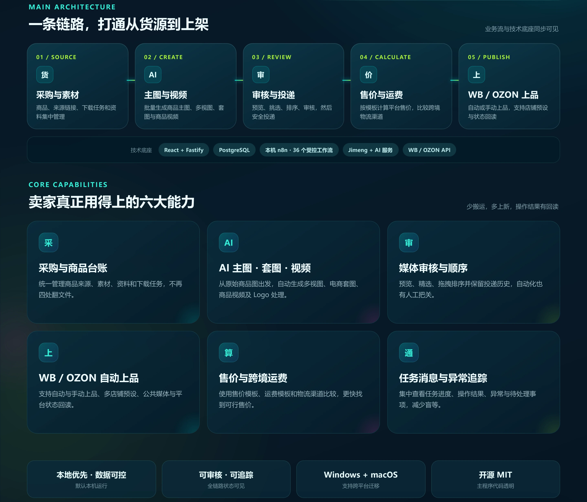
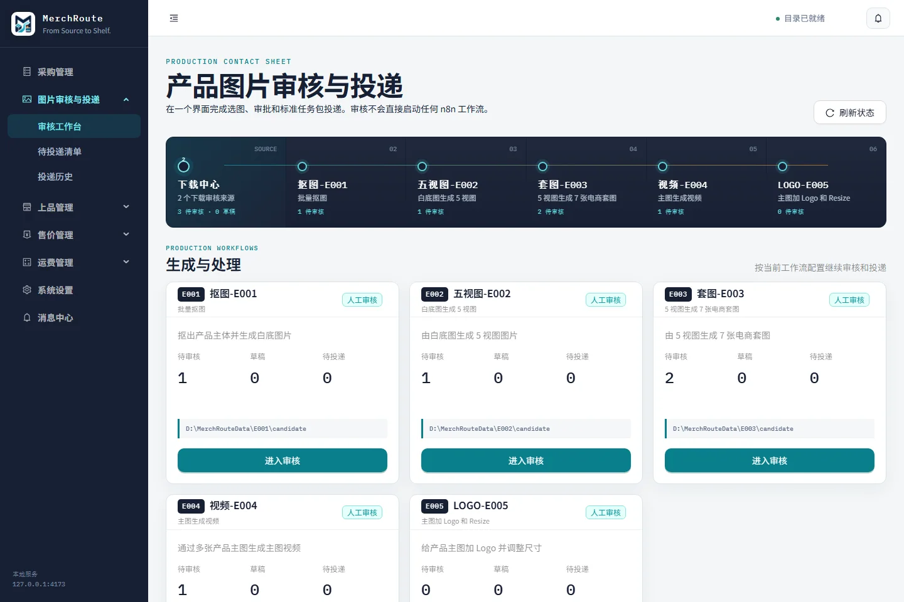
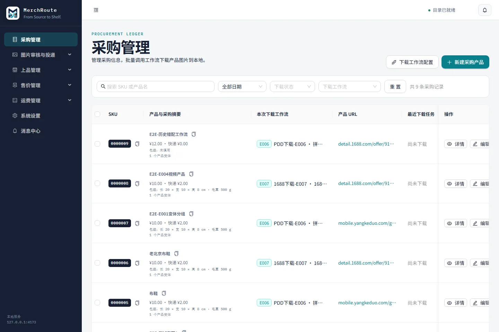
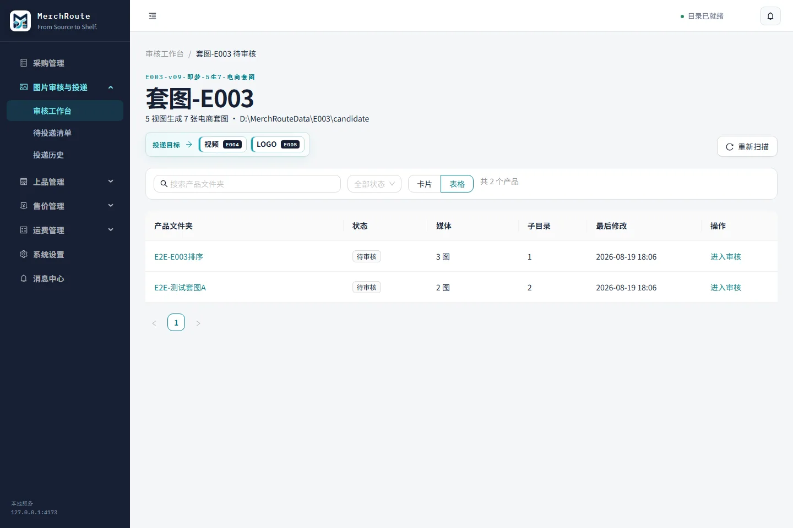
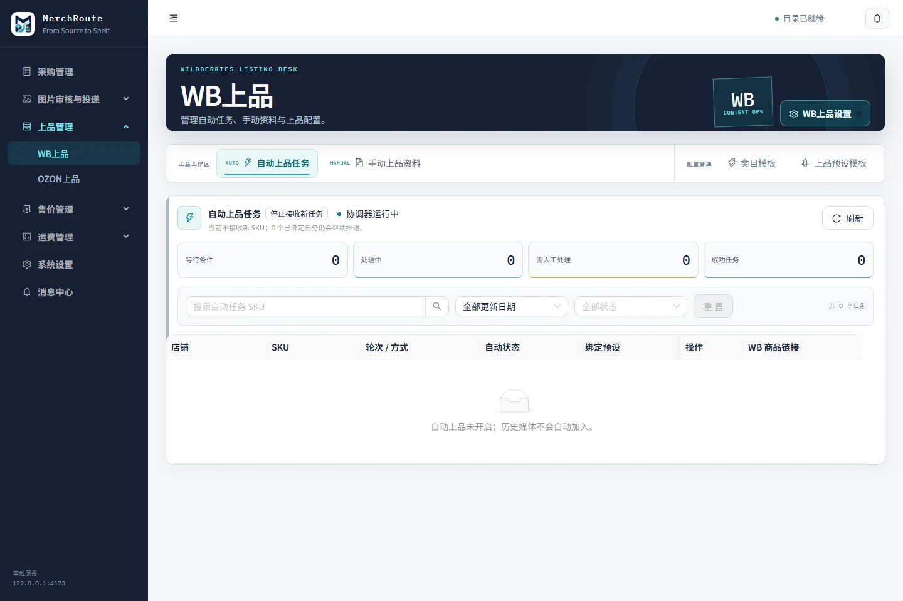
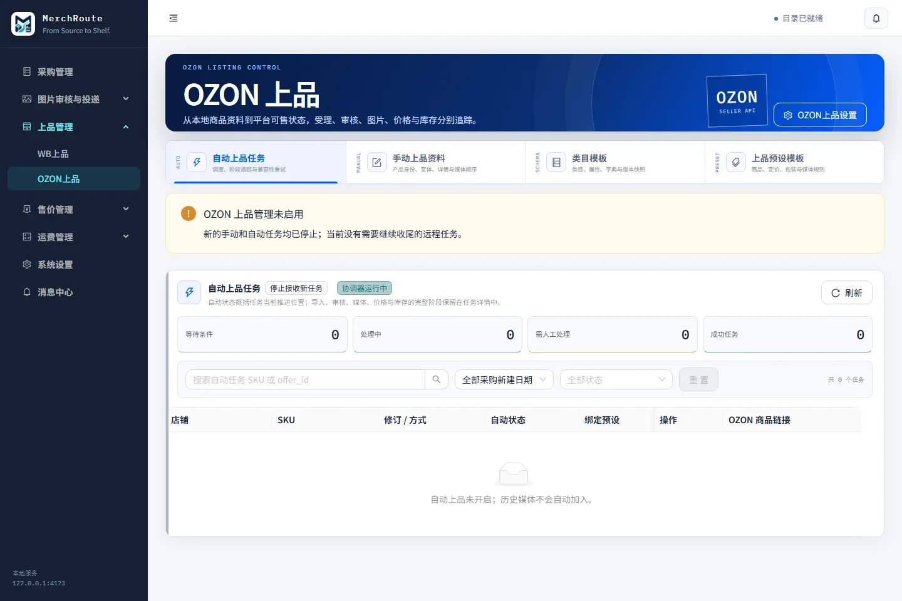
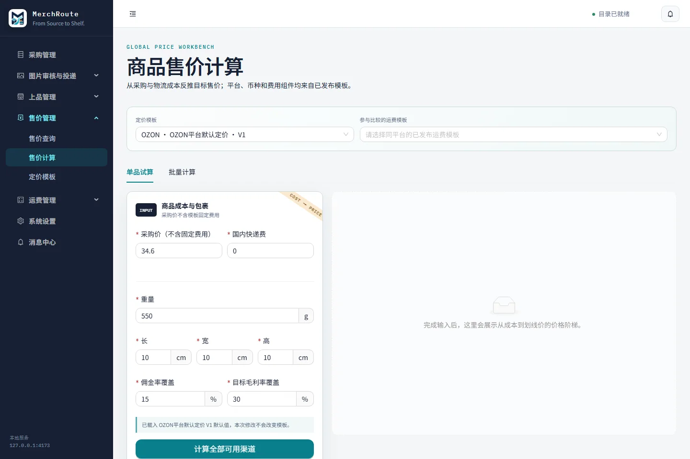
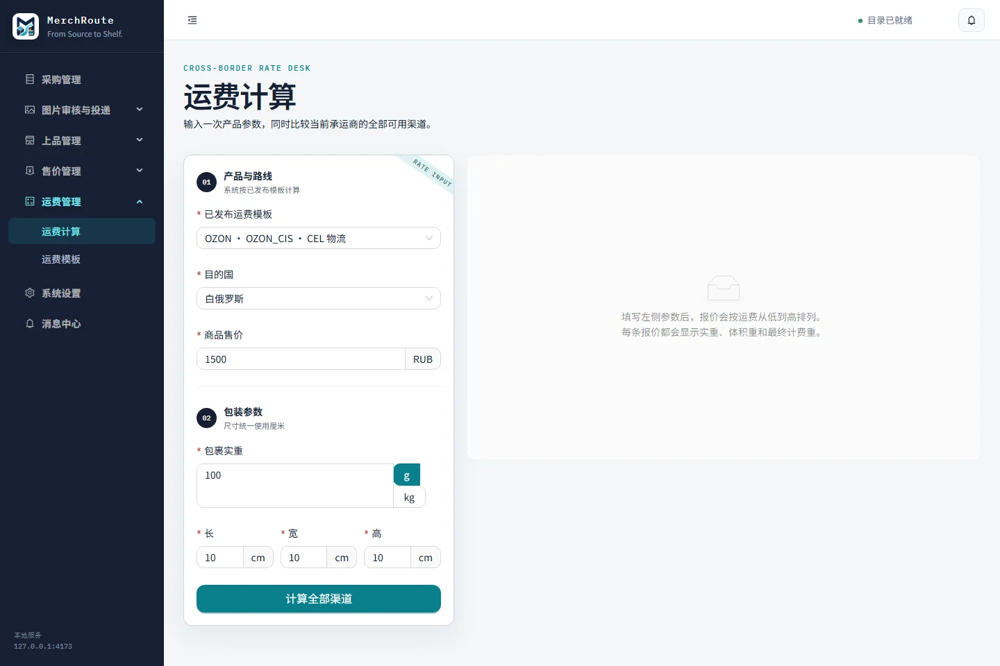
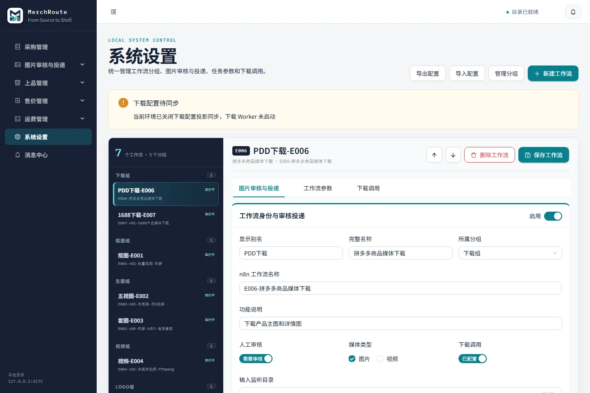
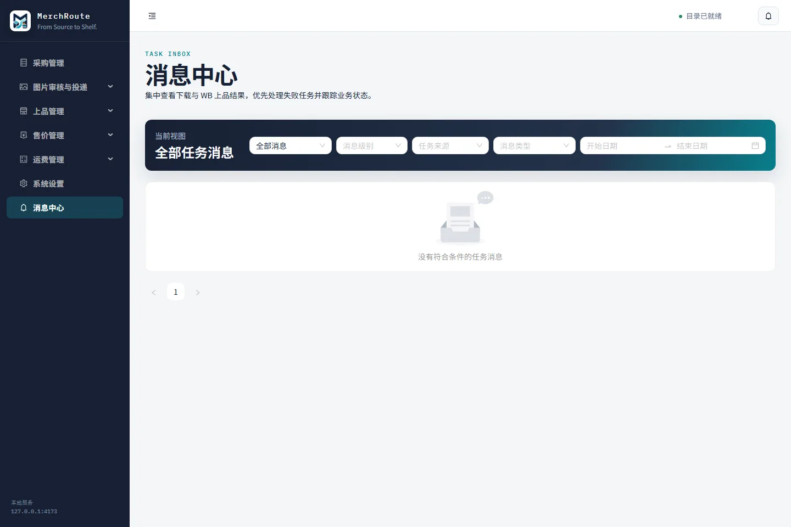

# MerchRoute

MerchRoute 是一套本地优先的电商运营工具，覆盖采购商品管理、电商主图与视频生成和审核、Wildberries（WB）与 OZON 自动/手动上品、售价、运费、系统设置及消息中心。它把 MerchRoute 应用、全局安装的 n8n、36 个受控工作流、PostgreSQL 与 Jimeng 代理组合成一套可审计、可迁移的本地系统。

[](https://nodejs.org/)
[](https://github.com/kyleliu-ai/MerchRoute/actions/workflows/ci.yml)
[](LICENSE)

## 功能模块

<p align="center">
  <a href="docs/assets/readme/merchroute-capabilities.webp"></a><br>
  <strong>一条链路，打通从货源到上架</strong>：业务流与技术底座同步可见；点击图片可查看原尺寸。
</p>

<details>
<summary><strong>查看功能模块文字版（便于检索、复制与无障碍阅读）</strong></summary>

### 从货源到上架的五阶段链路

| 阶段 | 模块 | 能力 |
| --- | --- | --- |
| 01 / SOURCE | 采购与素材 | 商品、来源链接、下载任务和资料集中管理 |
| 02 / CREATE | 主图与视频 | 批量生成商品主图、多视图、套图与商品视频 |
| 03 / REVIEW | 审核与投递 | 预览、挑选、排序、审核，然后安全投递 |
| 04 / CALCULATE | 售价与运费 | 按模板计算平台售价，比较跨境物流渠道 |
| 05 / PUBLISH | WB / OZON 上品 | 自动或手动上品，支持店铺预设与状态回读 |

**技术底座**：React + Fastify、PostgreSQL、本机 n8n・36 个受控工作流、Jimeng + AI 服务、WB / OZON API。

### 卖家真正用得上的六大能力

| 能力 | 说明 |
| --- | --- |
| 采购与商品台账 | 统一管理商品来源、素材、资料和下载任务，不再四处翻文件。 |
| AI 主图・套图・视频 | 从原始商品图出发，自动生成多视图、电商套图、商品视频及 Logo 处理。 |
| 媒体审核与顺序 | 预览、精选、拖拽排序并保留投递历史，自动化也有人工把关。 |
| WB / OZON 自动上品 | 支持自动与手动上品、多店铺预设、公共媒体与平台状态回读。 |
| 售价与跨境运费 | 使用售价模板、运费模板和物流渠道比较，更快找到可行售价。 |
| 任务消息与异常追踪 | 集中查看任务进度、操作结果、异常与待处理事项，减少盲等。 |

### 产品特性

- **本地优先・数据可控**：默认本机运行。
- **可审核・可追踪**：全链路状态可见。
- **Windows + macOS**：支持跨平台迁移。
- **开源 MIT**：主程序代码透明。

</details>

## 界面预览

以下界面由当前源码在隔离 E2E 数据库中使用合成商品生成，不包含真实店铺、凭据、商品数据或本机路径。点击图片可查看原尺寸。

<p align="center">
  <a href="docs/assets/ui/overview.webp"></a><br>
  <strong>图片审核与投递总览</strong>：集中查看 E001–E005 处理阶段、待审核数量和投递方向。
</p>

<table>
  <tr>
    <td width="50%"><a href="docs/assets/ui/procurement.webp"></a><br><strong>采购管理</strong>：采购台账、来源链接、下载工作流和任务状态。</td>
    <td width="50%"><a href="docs/assets/ui/media-review.webp"></a><br><strong>图片审核</strong>：按工作流查看产品媒体、审核状态和后续投递目标。</td>
  </tr>
  <tr>
    <td width="50%"><a href="docs/assets/ui/wb-listing.webp"></a><br><strong>WB 上品</strong>：自动任务、手动资料、类目模板和店铺预设。</td>
    <td width="50%"><a href="docs/assets/ui/ozon-listing.webp"></a><br><strong>OZON 上品</strong>：自动任务、多店铺手动上品、类目与预设管理。</td>
  </tr>
  <tr>
    <td width="50%"><a href="docs/assets/ui/pricing.webp"></a><br><strong>售价管理</strong>：结合采购、运费和平台费用计算目标售价。</td>
    <td width="50%"><a href="docs/assets/ui/shipping.webp"></a><br><strong>运费管理</strong>：按目的国、重量和体积比较跨境物流渠道。</td>
  </tr>
  <tr>
    <td width="50%"><a href="docs/assets/ui/settings.webp"></a><br><strong>系统设置</strong>：统一维护工作流、审核投递、运行参数和下载调用。</td>
    <td width="50%"><a href="docs/assets/ui/notifications.webp"></a><br><strong>消息中心</strong>：集中追踪任务结果、异常和待处理事项。</td>
  </tr>
</table>

## 系统组成与数据流

```text
采购商品 / 商品素材
        │
        ▼
MerchRoute ── PostgreSQL（业务数据）
        │
        ├── 审核、排序、投递 ── 本地业务媒体目录
        │
        └── 调用本机 n8n（36 个工作流，独立数据库）
                    │
                    ├── Jimeng 代理（Docker，127.0.0.1:8000）
                    ├── AI / 翻译 / 上传服务
                    └── WB / OZON 只读或上品接口
```

仓库中的工作流均已移除现有凭据绑定、Webhook 实例 ID 和运行状态。新部署只导入停用副本；任何工作流必须在人工核对后另行启用。

## 源码目录

```text
apps/web                         React 运营界面（全部业务模块）
apps/server                      Fastify API、数据库、文件与平台服务
packages/shared                  跨端类型、校验和业务常量
deployment/n8n                   36 个脱敏工作流、清单、凭据需求与导入工具
deployment/n8n/runtime-scripts   E006/E007 实际调用的下载、浏览器与图片拼接源码
deployment/postgres              两个隔离数据库的 PostgreSQL 18 定义
deployment/scripts               Windows、macOS 与跨平台部署脚本
integrations/jimeng-free-api-all Jimeng 代理的可独立构建 GPL-3.0 源码
scripts                          启动、验收、迁移和维护脚本
tests/e2e                        Playwright 浏览器测试
```

`integrations/jimeng-free-api-all/` 来源及补丁说明见其 [UPSTREAM.md](integrations/jimeng-free-api-all/UPSTREAM.md)。MerchRoute 主程序使用 MIT 许可证；该独立组件按其上游 GPL-3.0-only 许可证分发。

## 固定版本

| 组件 | 版本 |
| --- | --- |
| MerchRoute Node.js / npm | 22.23.1 / 10.9.8 |
| n8n（本机全局安装） | 2.32.6 |
| PostgreSQL | 18（测试版本 18.4） |
| Playwright | 1.61.1 |
| Jimeng Node.js / npm | 20.20.2 / 10.8.2 |
| Jimeng playwright-core / Chromium | 1.58.2 / 1208 |

机器可读契约在 [deployment/runtime-versions.json](deployment/runtime-versions.json)。版本不一致时不要继续安装依赖，先切换到固定版本并运行 `npm run versions:check`。

## 发布契约同步

README、智能体安装提示词和智能体升级提示词必须与同一个提交中的机器可读契约保持一致：

| 契约 | 权威文件 | 当前发布快照 |
| --- | --- | --- |
| 工具链和 Jimeng | [deployment/runtime-versions.json](deployment/runtime-versions.json) | Node.js `22.23.1`、npm `10.9.8`、n8n `2.32.6`、PostgreSQL `18.4`、Playwright `1.61.1`、Jimeng `0.9.1` |
| n8n 工作流 | [deployment/n8n/manifest.json](deployment/n8n/manifest.json) | 36 个唯一工作流、3 个部署包；新安装全部停用 |
| PostgreSQL | [deployment/postgres/init/01-databases.sh](deployment/postgres/init/01-databases.sh) | `merchroute` → `merchroute_app`；`merchroute_n8n` → `merchroute_n8n` |
| npm 依赖 | [package-lock.json](package-lock.json) | 锁文件安装，禁止用浮动 `latest` 替代固定版本 |

每次修改版本、工作流清单或数据库初始化契约时，必须在同一 PR 中更新本 README、[安装提示词](deployment/AGENT_INSTALL_PROMPT.zh-CN.md) 和[升级提示词](deployment/AGENT_UPDATE_PROMPT.zh-CN.md)。`npm run deployment:test` 会从上述权威文件读取实际值并阻止三份文档发生漂移；`npm run deployment:verify` 继续验证工作流数量、哈希、依赖和脱敏边界。

## 推荐部署方式：把一份提示词交给智能体

从干净的 Windows 11 或 Apple Silicon macOS 部署时，将 [智能体安装部署提示词](deployment/AGENT_INSTALL_PROMPT.zh-CN.md) 的完整内容复制给 Codex、Claude Code 等具备终端和文件权限的智能体。提示词要求智能体持续执行、调用已测试脚本、在本机凭据填写处暂停，并在全部只读验收后生成脱敏报告。

已经安装并有数据库、凭据或 PDD/1688 登录 Profile 的电脑，必须改用 [智能体安全升级提示词](deployment/AGENT_UPDATE_PROMPT.zh-CN.md)。升级流程会先完整备份，保留原 `MERCHROUTE_BROWSER_PROFILE_ROOT`，补齐 n8n 回环监听/节点配置，并在停机前与重启后阻断 E007 非终态执行；不要用全新安装流程覆盖既有状态。

脚本入口：

```powershell
# Windows PowerShell（从仓库根目录）
powershell -ExecutionPolicy Bypass -File deployment/scripts/bootstrap-windows.ps1
```

```bash
# Apple Silicon macOS（从仓库根目录）
chmod +x deployment/scripts/bootstrap-macos.sh
./deployment/scripts/bootstrap-macos.sh
```

遇到端口、Docker、数据库、n8n 所有者初始化或凭据探测问题时，见 [部署故障排查](deployment/TROUBLESHOOTING.zh-CN.md)。

维护 README 界面图时，先启动项目自带的隔离 E2E 服务，再运行 `npm run docs:capture-ui`。截图脚本只接受 `127.0.0.1:4183`，并要求存在 E2E 数据库标记，避免误截生产页面。

## 开发环境快速启动

采用一个固定开发目录、一个活动批次、一个写入任务。不要再为每次对话创建 worktree。正式服务使用独立运行包，开发目录不是正式服务入口。

```bash
npm run workflow -- status
npm run workflow -- begin --name example-batch --task-id example-task --baseline <已确认的本机提交> --dry-run
# 用户授权并完成外部目录/数据库登记后：
npm run dev
```

开发前端为 `127.0.0.1:5173`，仅代理开发后端 `127.0.0.1:4184`；E2E 使用 `4183`。正式服务默认为 `127.0.0.1:43173`，可在仓库外 `merchroute.env` 中同时设置 `MERCHROUTE_PORT` 和与之一致的 `MERCHROUTE_RUNTIME_BASE_URL`。端口被占用或被系统排除时直接停止并报告，不自动换端口。开发使用专用空库 `merchroute_dev` / `merchroute_dev_app`、合成数据及独立媒体目录，默认阻断真实外部业务请求，不读取生产环境文件。

当前源码版本为 **0.1.4 候选**；v0.1.2 与 v0.1.3 保留为已发布但本机未激活版本，且既有 Release 标签和资产均不可改写。0.1.4 仅修复正式切换的端点传递和旧版回滚身份验收。三种状态分别报告：开发完成、GitHub 已同步、正式运行已更新。完整操作与迁移/回滚门禁见[单人串行开发说明](docs/SINGLE_DEVELOPER_WORKFLOW.zh-CN.md)。

生产数据库、全局 n8n、Jimeng、媒体和 Profile 不随源码迁移。生产环境仍通过仓库外 `MERCHROUTE_ENV_FILE` 配置；`.env.runtime` 仅用于旧安装兼容。未经二次确认，不允许从 GitHub 覆盖本机权威内容。

## n8n 与 Jimeng

n8n 采用本机全局安装，不使用 n8n Docker 容器。部署脚本固定安装 `n8n@2.32.6`，启用工作流实际需要的内置模块 `fs,path,crypto,http,https,url,child_process,zlib`，允许节点读取必要环境变量，并通过 `N8N_RESTRICT_FILE_ACCESS_TO` 将文件访问限制在用户选择的业务媒体根目录。仓库目录、凭据目录和 n8n 用户目录均不在允许范围内。

E006/E007 使用的 Playwright、Sharp、幂等控制、登录和下载脚本也在仓库中。部署程序把源码复制到仓库外并安装锁定依赖；在目标电脑分别创建持久化的 PDD、1688 专用 Chrome User Data Directory，并用离线 headless 烟测验证可复用性。工作流文件中的路径使用跨平台模板，导入时解析为当前 Windows 或 macOS 的数据目录、Chrome 与浏览器 Profile 目录，不携带原电脑盘符、Cookie 或旧电脑登录状态。

全新 MerchRoute 配置默认包含 E006、E007、E001–E005。E007 使用独立的 `03-1688ProductMedia` 目录和 `/1688-product-media-download` Webhook；部署脚本会验证其系统配置、参数文件与 PostgreSQL 投影一致，但 n8n 中的 E007 仍保持停用，直到用户完成授权并明确决定启用。

工作流依赖 `n8n-nodes-globals@1.1.0`；36 个工作流及其三类部署包见 [deployment/n8n/README.md](deployment/n8n/README.md)。凭据必须在新机器本地重新输入，并由 n8n 使用新安装的 `N8N_ENCRYPTION_KEY` 加密。

Jimeng 代理由 [Docker Compose](integrations/jimeng-free-api-all/compose.yaml) 构建，只监听 `127.0.0.1:8000`，运行数据保存在仓库外的 Docker 卷 `/app/data`。验收请求 `GET /ping` 必须返回 `pong`。镜像基础与浏览器依赖支持 Docker Desktop 的 `linux/amd64`、`linux/arm64` 平台。

## 数据与安全边界

新部署的全部真实数据位于仓库外：

- Windows：`%LOCALAPPDATA%\MerchRoute\`
- macOS：`~/Library/Application Support/MerchRoute/`

禁止提交或粘贴到聊天中的内容包括 `.env`、数据库连接串和备份、n8n API Key/加密密钥/用户目录、WB/OZON/AI 平台凭据、Jimeng session/cookie、浏览器缓存、商品媒体和日志。数据库备份仍必须放在 GitHub 之外。

部署工具会创建仅当前用户可读的 `credentials.local.json`，但不会读取并输出其值；真实接口验收只执行账号、模型、余额或连接等无副作用探测，禁止创建商品、发布 Listing、生成付费媒体或上传真实商品素材。

提交前运行：

```bash
npm run deployment:verify
npm run n8n-runtime:test
npm run check
```

`deployment:verify` 固定验证 36 个唯一工作流、3 个部署包、依赖和哈希、凭据脱敏、数据库备份禁入以及 Jimeng 运行数据禁入。

## 文档

- [智能体安装部署提示词](deployment/AGENT_INSTALL_PROMPT.zh-CN.md)
- [智能体安全升级提示词](deployment/AGENT_UPDATE_PROMPT.zh-CN.md)
- [部署说明](deployment/README.md)
- [部署故障排查](deployment/TROUBLESHOOTING.zh-CN.md)
- [n8n 工作流部署包](deployment/n8n/README.md)
- [Windows 人工安装](docs/INSTALL-WINDOWS.md)
- [macOS 人工安装](docs/INSTALL-MACOS.md)
- [用户指南](docs/USER-GUIDE.md)
- [架构说明](docs/ARCHITECTURE.md)
- [安全策略](SECURITY.md)

## 联系仓库所有者

如需交流 MerchRoute 的使用、部署或电商自动化实践，可通过以下方式联系仓库所有者：

- 微信号：`kyleliuxie`
- 抖音号：`FKGolf`

<p align="left">
  
</p>

## 许可证

MerchRoute 主程序使用 [MIT License](LICENSE)。`integrations/jimeng-free-api-all/` 是独立的 GPL-3.0-only 组件，使用和再分发时须同时遵守其 [许可证](integrations/jimeng-free-api-all/LICENSE)。
